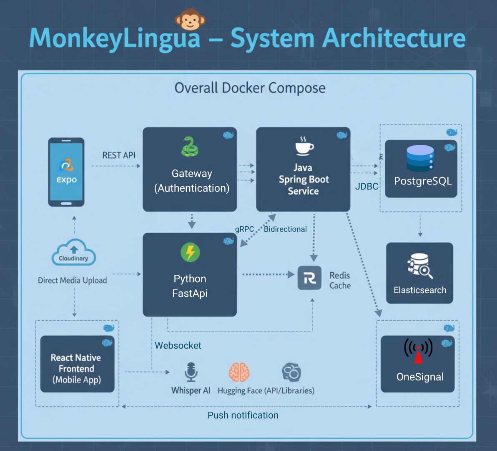

<p align="center">
  
</p>

<h1 align="center">MonkeyLingua</h1>

<p align="center">
  <strong>The Next-Generation Ecosystem for Professional English Mastery</strong>
</p>

<p align="center">
  <a href="https://reactnative.dev/"></a>
  <a href="https://spring.io/projects/spring-boot"></a>
  <a href="https://fastapi.tiangolo.com/"></a>
  <a href="https://konghq.com/"></a>
  <a href="https://www.docker.com/"></a>
</p>

<p align="center">
  <a href="https://monkey-lingua-landing.lovable.app/"><strong>🌐 Official Website</strong></a> •
  <a href="https://thaingocquyen.vercel.app"><strong>👨‍💻 Developer Portfolio</strong></a>
</p>

<p align="center">
  <a href="#">
    
  </a>
  </p>

<p align="center">
  <em>"Learning by Connection. Powered by Intelligence."</em>
</p>

---

## 📖 Product Overview

**MonkeyLingua** is not merely an application; it is a comprehensive **Language Learning Ecosystem** engineered for the modern professional. By bridging the gap between structured academic methodologies and immersive social interaction, MonkeyLingua creates a living environment where language acquisition happens naturally.

Our platform leverages **State-of-the-Art Generative AI** to provide real-time linguistic coaching, while our **Social-First Architecture** ensures that every user finds a partner, a mentor, or a community to practice with.

---

## 🌟 Feature Highlights

### 1. Intelligent Learning Pathways

Moving beyond static lessons, MonkeyLingua adapts to your career goals. Whether preparing for IELTS, Business Communication, or Daily Conversation, our **Dynamic Roadmaps** guide you step-by-step.

- **Spaced Repetition (SRS):** Flashcards powered by Anki-like algorithms.
- **Contextual Video:** Learn from real-world scenarios with AI-generated bilingual subtitles.
- **Proficiency Testing:** Automated input evaluation to constantly calibrate difficulty.

<p align="center">
  
</p>

### 2. AI-Powered Cognitive Suite

Your personal AI coach is available 24/7. Powered by a dedicated Python Microservice (Whisper + LLMs), we provide instant feedback that mimics a native tutor.

- **Pronunciation Scoring:** Real-time IPA (International Phonetic Alphabet) analysis.
- **Smart Chat:** The AI intercepts messages to suggest grammar corrections instantly.
- **Scenario Generation:** Infinite role-play scenarios tailored to your weak points.

<p align="center">
  
</p>

### 3. Immersive Social Ecosystem

Language is meant to be spoken. MonkeyLingua connects you with the world via high-performance WebSocket infrastructure.

- **Couple Mode:** Link accounts with a partner to track shared progress and celebrate anniversaries.
- **Video Conferencing:** Integrated Jitsi/WebRTC for crystal-clear 1:1 or Group study rooms.
- **Gamification:** Compete on global leaderboards, earn badges, and maintain streaks.

<p align="center">
  
</p>

---

## 🛠 Engineering Architecture

MonkeyLingua is built on a production-grade **Hybrid Microservices Architecture**, ensuring scalability, security, and fault tolerance.

### System Blueprint

Traffic is managed by **Kong Gateway**, routing requests to our **Spring Boot Monolith** (Core Logic) and **FastAPI Service** (AI Engine). Asynchronous operations are handled via **Apache Kafka**, while **Elasticsearch** powers our instant content retrieval.

<p align="center">
  
</p>

<details>
<summary><strong>View High-Level Diagram</strong></summary>
<p align="center">
  
</p>
</details>

---

## 🚀 Deployment & Usage Guide

This section outlines how to deploy the MonkeyLingua infrastructure for on-premise or cloud environments using Docker.

### Prerequisites

- **Docker Engine** (v20.10+) & **Docker Compose** (v2.0+)
- **RAM:** Minimum 8GB recommended (due to Elastic/Kafka stack).

### 1. System Orchestration

We utilize a unified `docker-compose` workflow to spin up the entire stack (Backend, AI, Databases, Cache, Message Brokers).

<p align="center">
  
</p>

Run the following command in the root directory:

```bash
docker-compose up --build -d
```

After the command finishes:

- **Backend Core:** Booting on port `8080`
- **AI Service:** RPC/REST active on port `50051`
- **Kong Gateway:** Accessible via `localhost:8000`

### 2. Configuration

Create a `.env` file at the project root. This file secures your infrastructure credentials.

```env
# Database & Cache
SPRING_DATASOURCE_URL=jdbc:postgresql://app-database:5432/linguaviet_db
SPRING_DATASOURCE_fullname=linguauser
SPRING_DATASOURCE_PASSWORD=secure_password
REDIS_HOST=redis
REDIS_PORT=6379

# Security & AI
JWT_SECRET=your_rsa_private_key_here
PYTHON_SERVICE_HOST=pythonservice
PYTHON_SERVICE_PORT=50051

# Third-Party Integrations
CLOUDINARY_CLOUD_NAME=your_cloud_name
CLOUDINARY_API_KEY=your_api_key
CLOUDINARY_API_SECRET=your_api_secret
FIREBASE_API_KEY=your_firebase_key
FIREBASE_PROJECT_ID=your_project_id
```

---

## 📸 Application Gallery

Experience the polished User Interface designed for engagement and clarity.

<p align="center">
  
</p>

---

## 🗺 Strategic Roadmap

We are committed to continuous innovation. Below is our development trajectory.

<p align="center">
  
</p>

| Status         | Module                   | Description                                     |
| :------------- | :----------------------- | :---------------------------------------------- |
| ✅ **Live**    | **Core LMS**             | Roadmaps, Courses, Tracking, Payment Gateway.   |
| ✅ **Live**    | **Cognitive AI**         | Speech Analysis (Whisper), Grammar Correction.  |
| ✅ **Live**    | **Real-time Comms**      | Chat, Video Calls, Rooms.                       |
| 🚧 **In-Dev**  | **Advanced RecSys**      | AI-driven personalized content recommendations. |
| 📅 **Planned** | **Enterprise Dashboard** | Analytics for corporate training partners.      |

---

## 🌍 Future Vision

Our mission extends beyond a mobile app. We aim to build a Global Learning Metaverse.

<p align="center">
  
</p>

---

## © Copyright & Legal

**MonkeyLingua Platform**
Copyright © 2025 MonkeyLingua Team. All Rights Reserved.

This software and its associated documentation are the proprietary intellectual property of the MonkeyLingua Team. Unauthorized reproduction, distribution, or reverse engineering of the core business logic or AI models is strictly prohibited without a formal commercial license.

<div align="center">
  <br/>
  <strong>Get in touch with the Creator</strong>
  <br/>
  <br/>
  <a href="mailto:quyen10924@gmail.com">
    
  </a>
  <a href="https://thaingocquyen.vercel.app">
    
  </a>
</div>
