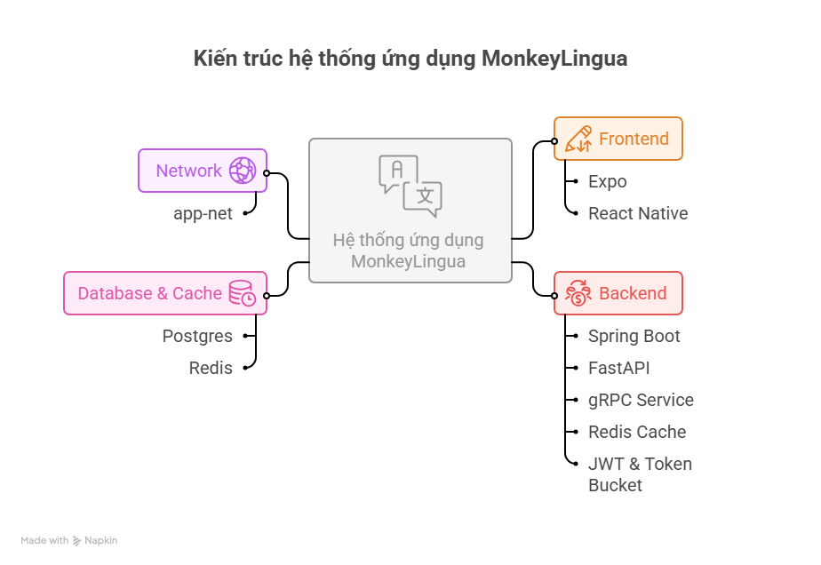
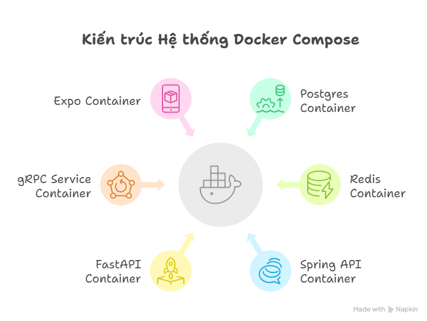
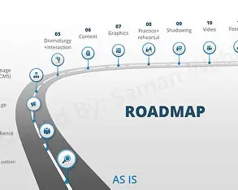
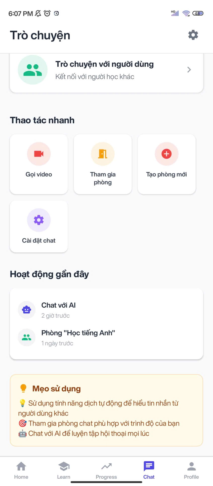

# 🐵 MonkeyLingua – Learn Smarter, Speak Better

[](LICENSE) 
[](https://reactnative.dev/)
[](https://fastapi.tiangolo.com/)
[](https://www.docker.com/)

---

## 🎯 Overview

**MonkeyLingua** is a **comprehensive English-learning platform** integrating **AI-powered assistance** and **real-time interaction**. It combines:

- Structured learning with gamification  
- Intelligent feedback for pronunciation & grammar  
- Global peer-to-peer communication  

<p align="center">
  
</p>

> “Learning by connection, powered by AI.”

---

## 📚 Key Features

### 🏫 Learning Platform
- **Dynamic Roadmaps** – Adaptive learning paths based on personal goals (certifications, career, daily practice)  
- **Courses & Flashcards** – Vocabulary & grammar practice with **Anki-like spaced repetition**  
- **Video Learning**:  
  - Bilingual videos with **context-aware subtitles**  
  - Video call integration with AI-assisted real-time translation  

<p align="center">
  
</p>

### 🤖 AI-Powered Assistance
- **Real-Time Voice Feedback** – Pronunciation analysis & IPA scoring  
- **Storytelling & Conversation Generation** – AI generates quizzes, dialogues, and interactive exercises  
- **Smart Chat** –  
  - Real-time messaging with AI translation  
  - Vocabulary & grammar correction during chat  
  - Peer-to-peer interaction matched by language & learning goals  

<p align="center">
  
</p>

### 💬 Social & Communication
- WebSocket-based **real-time chat** with reactions & message history  
- Group & 1:1 **video calls** via embedded **Jitsi Meet**  
- Gamification: badges, EXP, streaks, leaderboards  

<p align="center">
  
</p>

---

## ⚙️ Architecture & Technology Stack

<p align="center">
  
</p>

### Backend
- **Spring Boot Monolith** – Core services  
- **Python FastAPI** – AI & speech processing (Whisper + OpenAI)  
- **gRPC** – Async communication between services  
- **Redis** – Caching frequently accessed data  
- **JWT & Token Bucket** – Authentication & rate limiting  

### Frontend
- **React Native Expo** – Android & iOS  
- **Zustand** – State management  
- **useSWR** – Data fetching & caching  
- Direct media uploads to Cloudinary  

### Database
- **PostgreSQL** – ~50 tables  
  - Users, Roles, Permissions  
  - Courses, Lessons, Flashcards, Question Banks  
  - Chat Messages, Rooms, Video Calls  
  - Gamification: Leaderboards, Badges  
  - Tracking & Analytics  

---

## 🐳 Docker Deployment

```bash
docker-compose up --build
```

- **backend**: Spring Boot (port 8080)  
- **ai-service**: FastAPI gRPC service (port 50051)  
- **frontend**: Expo dev server  
- **PostgreSQL & Redis**: persistent data & caching  

<p align="center">
  
</p>

---

## 🛠 Environment Variables

Create `.env` at project root:

```env
SPRING_DATASOURCE_URL=...
SPRING_DATASOURCE_USERNAME=...
SPRING_DATASOURCE_PASSWORD=...
REDIS_HOST=...
REDIS_PORT=...
JWT_SECRET=...
PYTHON_SERVICE_HOST=...
PYTHON_SERVICE_PORT=...
CLOUDINARY_CLOUD_NAME=...
CLOUDINARY_API_KEY=...
CLOUDINARY_API_SECRET=...
FIREBASE_API_KEY=...
FIREBASE_PROJECT_ID=...
```

---

## 🚀 Roadmap

| Status | Feature |
|--------|---------|
| ✅ | Core learning modules & progress tracking |
| ✅ | AI transcription & analysis |
| ✅ | Real-time chat & video call |
| ⬜ | AI-driven personalized recommendations |
| ⬜ | Admin dashboard & analytics |

<p align="center">
  
</p>

---

## 🌍 Vision & Global Impact

- **Global Learning Community** – Connect learners worldwide  
- **Real-Time AI Feedback** – Instant pronunciation & grammar corrections  
- **Adaptive Learning** – AI-powered personalized learning paths  
- **Future Expansion** – AR/VR classrooms, emotion-aware AI coaches, multi-language support  

<p align="center">
  
</p>

---

## 🔒 Security & Performance

- **JWT & OAuth2** for secure authentication  
- **Token Bucket** algorithm for rate limiting  
- Encrypted sensitive data  
- Low-latency real-time interactions (<300ms for voice feedback)  

---

## 📸 Screenshots & Assets

Include screenshots for:  
- Learning dashboard  
- Chat & video call  
- Flashcards & quizzes  
- Leaderboards & progress charts  

<p align="center">
  
</p>

---

## 📜 License

MIT © 2025 MonkeyLingua Team